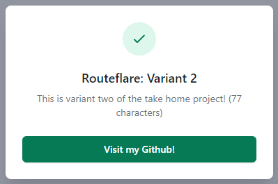

# Jason Le's Cloudflare Workers Internship Application: Full-Stack

### Notes

After using a few different solutions from AWS lambda, STDLib and GCP Functions, I found that Cloudflare workers was extremely easy to use and deployed in milliseconds to a domain setup with clcoudflare. The new `wrangler dev` made it easy to progressively build out the worker and test.

## Extra Credits

### Changing copy/URLs

- The HTMLRewriter API provided a neat way of modifying static content
    - Using `element handlers`
        - the title of the web page can be updated to `Routeflare`
        - the main title on the page can be prepended with content
        - the url's `href` attribute can be updated and text updated
    - Using `text chunks` we can combine all chunks to count the characters

### Deployment
Using the wrangler environments, I can have two different deployments
1. "Fake" Production https://jasonle.org/routeflare

2. "Fake" Development on workers.dev https://routeflare.jqwotos.workers.dev/
